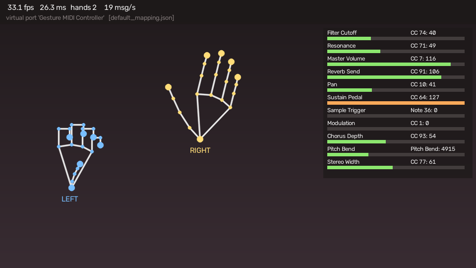
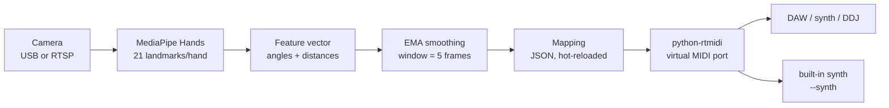

# Musical Instrument Gesture Controller

Turn hand movements in front of a camera into real-time MIDI control changes.
Filter cutoff, reverb send, volume, pitch bend and the sustain pedal, played
with your hands in the air — no controller to touch.

The controller appears as an ordinary MIDI device, so anything that speaks MIDI
picks it up: Logic Pro, Ableton Live, GarageBand, rekordbox, a Pioneer DDJ over
the IAC loopback, or a digital piano through a USB-MIDI interface.



*The preview window (`--show`). Skeletons are what the tracker sees; the meters
are the values actually being sent. Rendered by `src/visualizer.py` from
synthetic landmarks — drop in a GIF of your own hands at
`docs/assets/demo.gif` once you have recorded one.*

---

## How it works



Every stage is a separate module under `src/`, and the interesting one is the
third: raw landmarks are unusable as MIDI sources because they move when the
hand moves *closer*, not just when it moves. `gesture_features.py` converts them
into scale- and rotation-invariant quantities in `[0, 1]`, which the mapper then
scales into whatever CC you asked for.

**Measured latency: 26 ms camera-to-MIDI at 33 fps** (640x960 input, CPU-only
Linux container, no preview window). Well inside the 50 ms target where gesture
control still feels like an instrument rather than a remote control. Run with
`--stats-interval 1` to measure it on your own machine.

---

## Install

```bash
git clone https://github.com/nariman7596/Musical-Instrument-Gesture-Controller.git
cd Musical-Instrument-Gesture-Controller

python3 -m venv .venv && source .venv/bin/activate
```

Then pick the install set for your platform:

```bash
# macOS (Python 3.9-3.12)
pip install -r requirements-macos.txt

# Linux / Windows (Python 3.11+)
pip install -r requirements.txt
```

Two files because MediaPipe 1.x aborts on macOS inside the hand graph
(`Check failed: service_ Service is unavailable`, from `DrishtiMetalHelper`):
its macOS build wires Metal calculators into the graph without registering the
Metal service, and no Python-level flag turns that off. MediaPipe 0.10.x and its
`solutions` API do not have the problem, so that is what the macOS set pins —
`src/hand_tracker.py` detects which API is installed and adapts. Both are
covered by the test suite.

The MediaPipe hand model (~7.5 MB) is downloaded and cached in
`~/.cache/gesture-midi-controller/` the first time you run the controller. To
place it yourself, pass `--model /path/to/hand_landmarker.task`.

### macOS: create a MIDI destination

By default the controller **creates its own virtual port** called
`Gesture MIDI Controller`, and every DAW sees it immediately — no setup at all.

You only need the IAC Driver if you want to route into an application that
insists on a system port (or into rekordbox / a DDJ mapping):

1. Open **Audio MIDI Setup** (`/Applications/Utilities`).
2. **Window → Show MIDI Studio**.
3. Double-click **IAC Driver**, tick **Device is online**, keep `Bus 1`.
4. Run with `--port "IAC Driver"`.

Check what your machine offers:

```bash
python main.py --list-ports
```

---

## Usage

```bash
# USB webcam, virtual MIDI port, preview window with meters
python main.py --camera 0 --show

# Ceiling RTSP camera, theremin preset, into the IAC loopback
python main.py --camera rtsp://admin:@192.168.1.15:554/stream1 \
               --config config/theremin.json --port "IAC Driver"

# Straight into a digital piano on a USB-MIDI interface
python main.py --camera 0 --port "UM-ONE" --channel 2

# No MIDI hardware? Print the messages instead of sending them
python main.py --dry-run --show
```

`--camera` takes a webcam index (`0`, `1`, ...), an RTSP/HTTP URL, or the path to
a video file — handy for developing against a recording instead of your own arm.

### The one-file version

If you just want to wave your hand and hear a melody, `examples/one_file_gesture_music.py`
is the whole idea in a single script with nothing to configure:

```bash
python examples/one_file_gesture_music.py
```

Camera, tracking, note choice, synthesis and audio out, all in one file — useful
for reading end to end, or for lifting into your own project. The full version
below adds MIDI output to a DAW, JSON mapping files, two-handed gestures, hot
reload and the meter overlay.

### Playing it like an instrument

`config/play.json` maps the right hand's position to **notes of a pentatonic
scale**, so moving your hand plays a melody rather than only shaping a tone:

```bash
python main.py --camera 0 --show --synth --config config/play.json
```

Right hand across the frame picks the note (higher to the right), raise it to
play louder. Left hand height opens the filter, pinch it to fade out, make a
fist to hold notes into a chord, peace sign for vibrato. Take the right hand out
of frame and it stops.

The notes are quantised to a scale, so a wandering hand still lands in key — and
a small dead band around each note stops a shaky hand stuttering between two
pitches. Set `scale` to any of `pentatonic_minor`, `pentatonic_major`, `major`,
`minor`, `blues`, `dorian` or `chromatic`, `root` to where it starts, and
`octaves` to how far the ladder reaches.

### Hearing it without a DAW

A control change only *shapes* a sound that something else is playing, so the
first run is quietly confusing: everything works and nothing is audible. The
built-in synth removes that step —

```bash
python main.py --camera 0 --show --synth
```

— and you hear the filter open as you raise your hand, with no DAW, no port
routing and nothing else to install. It holds a drone note (A2 by default, so
there is always something for the filter to shape), adds voices when a note
mapping fires, and follows volume, pan, resonance, reverb, modulation, sustain
and pitch bend. It is fed the *same* `MidiEvent` objects that go out of the MIDI
port, so what you hear is what a DAW receives.

| Flag | Purpose |
| --- | --- |
| `--synth` | turn the monitor synth on |
| `--drone NOTE` | note held continuously; `-1` for none (default: 45, A2) |
| `--synth-gain` | output level (default: 0.28) |

It is a monitor, not the instrument — the way a metronome is a monitor. For real
work, send the MIDI to a real synth.

### Keyboard controls (preview window)

| Key | Action |
| --- | --- |
| `q` / `Esc` | quit (sends all-notes-off first) |
| `m` | mute MIDI output, keep tracking |
| `p` | panic: release every held note and gate |
| `r` | reload the mapping file now |
| `d` | print the current feature values to the console |

### Useful flags

| Flag | Purpose |
| --- | --- |
| `--config PATH` | mapping file (default `config/default_mapping.json`) |
| `--port NAME\|INDEX` | send to an existing port instead of creating a virtual one |
| `--channel N` | force every mapping onto MIDI channel `N` |
| `--dry-run` | print messages, touch no MIDI hardware |
| `--no-mirror` | do not flip the image (mirror view is the default) |
| `--rtsp-transport udp` | lower latency on a good network; `tcp` is the default |
| `--max-hands 1` | track one hand only — a little faster |
| `--debug-features` | stream the live feature vector to the console |
| `--stats-interval 1` | report fps / latency / message rate every second |
| `--list-features` | print every feature name a mapping can use |
| `--list-ports` | print the MIDI output ports on this machine |

---

## The default gesture map

`config/default_mapping.json`, split the way hands naturally divide the work:
the right hand shapes the sound, the left hand handles transport.

| Gesture | MIDI | Feature |
| --- | --- | --- |
| Right hand height | CC 74 filter cutoff | `right.height` |
| Right hand left/right | CC 71 resonance | `right.x` |
| Right thumb-index pinch | CC 7 master volume (pinch = quiet) | `right.pinch` |
| Right hand openness | CC 91 reverb send | `right.openness` |
| Right palm roll | CC 10 pan | `right.roll` |
| Left fist | CC 64 sustain pedal on/off | `left.fist` |
| Left index pointing up | Note 36, velocity from hand height | `left.point_up` |
| Left peace sign | CC 1 modulation | `left.peace` |
| Distance between hands | CC 93 chorus depth | `both.hands_distance` |
| One hand above the other | pitch bend | `both.hands_vertical_delta` |
| Horizontal hand spread | CC 77 stereo width | `both.hands_spread` |

Two more presets ship with it: `config/play.json` turns it into a playable
instrument (see above), and `config/theremin.json` is built for a camera mounted
further away (the ceiling V380) — fewer, wider gestures and heavier smoothing.

---

## Writing your own mapping

The mapping file is the instrument's patch — no code changes, and **it reloads
while the controller is running**, so you can edit a CC number mid-take and hear
the change on the next frame. A file that fails to parse is reported and
ignored, keeping the previous patch alive.

```json
{
  "version": 1,
  "midi": { "channel": 1, "port_name": "Gesture MIDI Controller" },
  "smoothing": { "window": 5, "reset_after": 30 },
  "mappings": [
    {
      "name": "Filter Cutoff",
      "feature": "right.height",
      "type": "cc",
      "cc": 74,
      "input_range": [0.15, 0.9],
      "curve": 1.4,
      "deadband": 1
    }
  ]
}
```

### Mapping types

| `type` | Sends | Extra fields |
| --- | --- | --- |
| `cc` | control change 0-127 | `cc` (required) |
| `scale` | notes of a musical scale, monophonic | `root`, `scale`, `octaves`, `velocity`, `gate_feature`, `hysteresis` |
| `gate` | control change on/off | `cc`, `value_on`, `value_off`, `threshold`, `release` |
| `note` | note on / note off | `note`, `velocity`, `velocity_feature`, `retrigger`, `threshold`, `release` |
| `pitch_bend` | 14-bit pitch bend | — |
| `aftertouch` | channel pressure | — |

### Fields every mapping understands

| Field | Default | Meaning |
| --- | --- | --- |
| `name` | `mapping N` | shown in the log and on the overlay |
| `feature` | required | which feature drives it (`--list-features`) |
| `channel` | `midi.channel` | MIDI channel 1-16 |
| `enabled` | `true` | set `false` to park a mapping without deleting it |
| `smoothing` | `smoothing.window` | per-mapping EMA window, in frames |
| `comment` | — | free text; the file is the documentation |

### Continuous mappings (`cc`, `pitch_bend`, `aftertouch`)

| Field | Default | Meaning |
| --- | --- | --- |
| `input_range` | `[0, 1]` | portion of the feature to use; narrow it to get full travel from a smaller movement |
| `output_range` | full range | limit the MIDI values sent, e.g. `[20, 127]` to never fully mute |
| `invert` | `false` | flip the direction |
| `curve` | `1.0` | response curve; `> 1` gives finer control at the bottom |
| `deadband` | `1` (`64` for bend) | minimum change worth sending — this is what keeps a still hand silent |
| `rate_limit_hz` | none | cap the message rate for a busy control |

### Scale mappings (`scale`)

| Field | Default | Meaning |
| --- | --- | --- |
| `root` | `57` (A3) | lowest note of the ladder |
| `scale` | `pentatonic_minor` | which notes are reachable at all |
| `octaves` | `2` | how far the ladder reaches |
| `gate_feature` | `<hand>.present` | what decides when it sounds |
| `hysteresis` | `0.2` | extra travel needed to change note, in note steps |
| `velocity_feature` | — | feature scaling how hard each note is struck |

### Gates and notes (`gate`, `note`)

| Field | Default | Meaning |
| --- | --- | --- |
| `threshold` | `0.6` | value at which the gate fires |
| `release` | `0.4` | value at which it lets go |

Two thresholds rather than one: the gap is a Schmitt trigger, and it is what
stops a hand hovering between "fist" and "not quite fist" from machine-gunning
the sustain pedal. `release` must not be above `threshold`.

---

## Feature reference

Run `python main.py --list-features`, or:

| Feature | Meaning |
| --- | --- |
| `<hand>.present` | 1.0 while the hand is tracked |
| `<hand>.height` | wrist height in frame (1.0 = top) |
| `<hand>.x` | wrist horizontal position (0.0 = left edge) |
| `<hand>.depth` | apparent palm size (1.0 = closest to the lens) |
| `<hand>.pinch` | thumb-index pinch (1.0 = touching) |
| `<hand>.openness` | fist (0.0) to open hand (1.0) |
| `<hand>.finger_spread` | gap between neighbouring fingertips |
| `<hand>.roll` | palm roll; 0.5 = level, 0.0/1.0 = ±90° |
| `<hand>.fist` | gate: all four fingers curled |
| `<hand>.open_palm` | gate: all fingers extended |
| `<hand>.point_up` | gate: index up, others curled |
| `<hand>.peace` | gate: index + middle up, ring + pinky curled |
| `<hand>.{thumb,index,middle,ring,pinky}_extension` | per-finger, 0.0 = curled |
| `both.hands_distance` | wrist-to-wrist distance (theremin axis) |
| `both.hands_vertical_delta` | vertical wrist offset; 0.5 = level |
| `both.hands_spread` | horizontal wrist spread |

`<hand>` is `left` or `right`, **from the player's point of view**. A hand that
is not currently tracked reports only `present`; the mapper then *holds* its last
value instead of slamming the controller to zero when tracking blinks.

### Calibration

The thresholds that turn geometry into `[0, 1]` live in `FeatureCalibration`
(`src/gesture_features.py`) and can be overridden per patch:

```json
"calibration": {
  "pinch": [0.2, 1.4],
  "hands_distance": [0.1, 1.2],
  "extended_threshold": 0.7
}
```

Run `--debug-features` (or press `d`), make the gesture, and read off the values
you actually produce — then set the range to match. Small hands, a wide-angle
lens or a camera three metres away all shift these.

---

## Design notes

**Why joint angles for finger curl, not distances.** The obvious metric — how
far the fingertip sits from the knuckle — collapses when the hand points at the
camera, and an outstretched hand then reads as a fist. The summed bend of the
PIP and DIP joints stays near 0° for a straight finger and above 150° for a
curled one from any angle. Verified against photographs of real hands
(`tests/data/reference_landmarks.json`).

**Why the aspect ratio matters.** MediaPipe normalises `x` and `y` separately,
so on a 16:9 frame one unit of `x` is 1.78× longer than one unit of `y`. Every
distance is computed after multiplying `x` by the frame aspect ratio; without it,
a pinch means something different on the left of the frame than in the middle.

**Why an EMA.** One multiply per feature, one intuitive knob, and the lag is
predictable: `window=5` at 30 fps costs about 60 ms of smoothing. It also
debounces the pose gates for free — smoothing turns a 0/1 flip into a ramp, and
the Schmitt trigger reads that ramp as a hold-off.

**Why `python-rtmidi` directly instead of `mido`.** Same library underneath, one
less layer of Python objects on a path that runs 30 times a second. `mido` is a
lovely API for scripting MIDI files; here the hot loop just wants bytes.

**Why the deadband.** A hand is never perfectly still. Without it a "held" filter
sweep is a stream of `74 → 75 → 74` messages: audible zipper noise, and traffic
that a DAW has to chew through. With it, a still hand sends nothing at all.

---

## Project layout

```
├── main.py                    # CLI, main loop, stats, keyboard controls
├── src/
│   ├── camera.py              # webcam / RTSP capture, frame dropping, reconnect
│   ├── hand_tracker.py        # MediaPipe wrapper (Tasks + legacy backends)
│   ├── gesture_features.py    # landmarks -> named features in [0, 1]
│   ├── smoother.py            # EMA smoothing + Schmitt trigger
│   ├── midi_mapper.py         # config parsing, scaling, hot reload
│   ├── midi_output.py         # python-rtmidi virtual/real port output
│   ├── synth.py               # built-in monitor synth, so it makes sound alone
│   └── visualizer.py          # skeleton + CC meter overlay
├── config/
│   ├── default_mapping.json   # the studio patch described above
│   ├── play.json              # playable pentatonic lead, for --synth
│   └── theremin.json          # wide, two-handed patch for a distant camera
├── examples/
│   └── one_file_gesture_music.py  # the whole idea in one script
├── notebooks/
│   └── 01_landmark_exploration.ipynb
└── tests/                     # 245 tests, no camera, MIDI or audio hardware needed
```

## Tests

```bash
pip install -r requirements-dev.txt
pytest
```

The suite passes on both install sets (MediaPipe 0.10.21 with NumPy 1.26 and
OpenCV 4, and MediaPipe 1.0.1 with NumPy 2.4 and OpenCV 5). It runs without a
camera, without a MIDI device and (mostly) without MediaPipe: geometry is checked against a synthetic hand generator, and the pose
classifiers are checked against landmarks extracted from real photographs. The
end-to-end test drives `main.py` over a generated video clip with MIDI going to
the dry-run sink, and skips itself if MediaPipe is not installed.

## Troubleshooting

| Symptom | Fix |
| --- | --- |
| `could not open camera source 0` | try `--camera 1`; on macOS grant camera access in System Settings → Privacy & Security |
| `no MIDI output ports found` | run without `--port` to create a virtual one, or enable the IAC Driver |
| `could not initialise the system MIDI backend` | no CoreMIDI/ALSA available — use `--dry-run` to test the mapping |
| `Check failed: service_ Service is unavailable` on macOS | MediaPipe 1.x and its Metal path; install `requirements-macos.txt` (MediaPipe 0.10.x) |
| Left and right controls are swapped | the two MediaPipe APIs label handedness oppositely; make sure `src/hand_tracker.py` is current, and check the `--no-mirror` setting |
| Preview window never appears | OpenCV has no GUI support (`opencv-python-headless`); install `opencv-python` |
| Values jump around | raise `smoothing.window`, or widen the `release`/`threshold` gap |
| Controls feel sluggish | lower `smoothing.window`, drop `--show`, or use `--max-hands 1` |
| Gestures never trigger | run `--debug-features`, read the real values, adjust `calibration` |
| Everything works but there is no sound | expected — CCs only shape a sound that already exists. Add `--synth`, or hold notes on a keyboard while gesturing |
| One droning note, no melody | that patch only sends control changes; use `--config config/play.json` to play notes with your hand |
| `audio output unavailable: PortAudio library not found` | Linux only; `sudo apt install libportaudio2`. The macOS and Windows wheels bundle it |
| RTSP stream stutters | try `--rtsp-transport udp`, or lower the camera's resolution |

## License

MIT — see [LICENSE](LICENSE).
